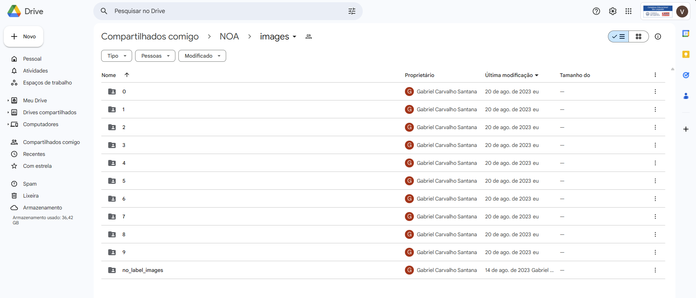
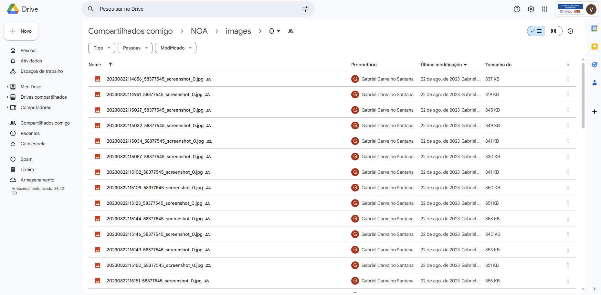

# Algoritmos

## Diretório Classificação Auxiliar:

### data_processing (código em python): 

Código de apoio utilizado pelo grupo para facilitar a redistribuição automática das imagens após sua classificação manual nas suas respectivas pastas.

#### Detalhes:
após a instalação da câmera de segurança no estabelecimento (necessária para a coleta de dados), suas imagens foram armazenadas em um Google Drive compartilhado, conforme as seguintes figuras:

Deste modo, novas imagens são armazenadas no diretório “no_label_images” e manualmente categorizadas de acordo com o número de pessoas na foto (exceto pelos atendentes), para serem então movidas para seus respectivos destinos (alteramos um caractere no nome da imagem pelo número de pessoas), as pastas de nome numérico, onde cada número representa a etiqueta da figura (label), ou seja, o número de clientes na imagem.

## Diretório Visão computacional:

### Computer_Vision_Architecture (código em python): 

Teste de conceito para o algoritmo de reconhecimento de pessoas, com a biblioteca TensorFlow, utilizando como fonte de treinamento as imagens provenientes da câmera localizada no estabelecimento, após a sua classificação manual.
